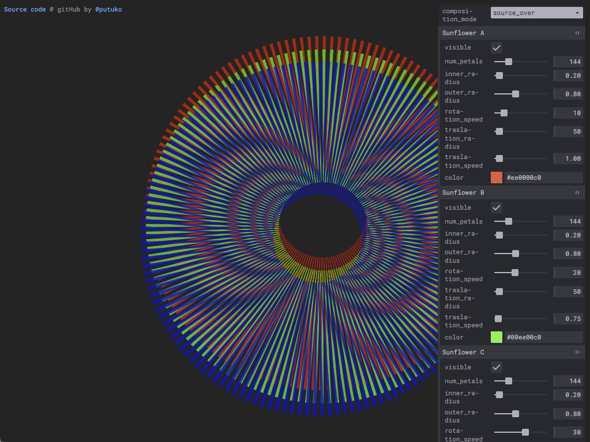

### Generative Art Sketches: Radial Moiré

Basado en este [tweet de @ThePrintArkive](https://twitter.com/ThePrintArkive/status/1577938732153544705) que muestra una bonita portada de una revista de 1966 («ICI Plastics Today 27»), en el que puede verse un diseño está compuesto por una especie de _marcas de registro_ desalineadas, lo que produce un curioso [efecto de moiré](https://es.wikipedia.org/wiki/Patr%C3%B3n_de_muar%C3%A9).

You can play with it online at: <https://radial-moire.netlify.app/>